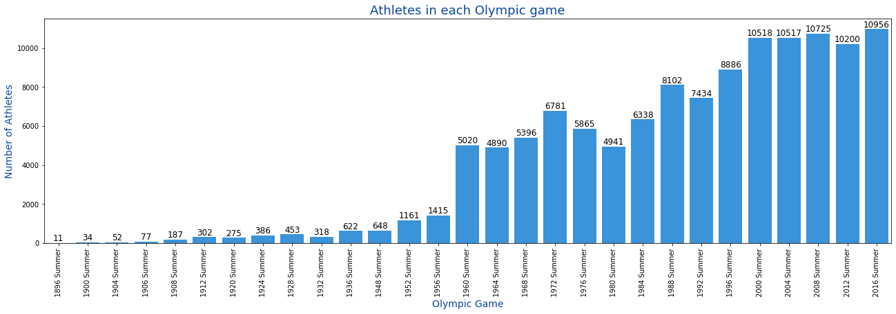
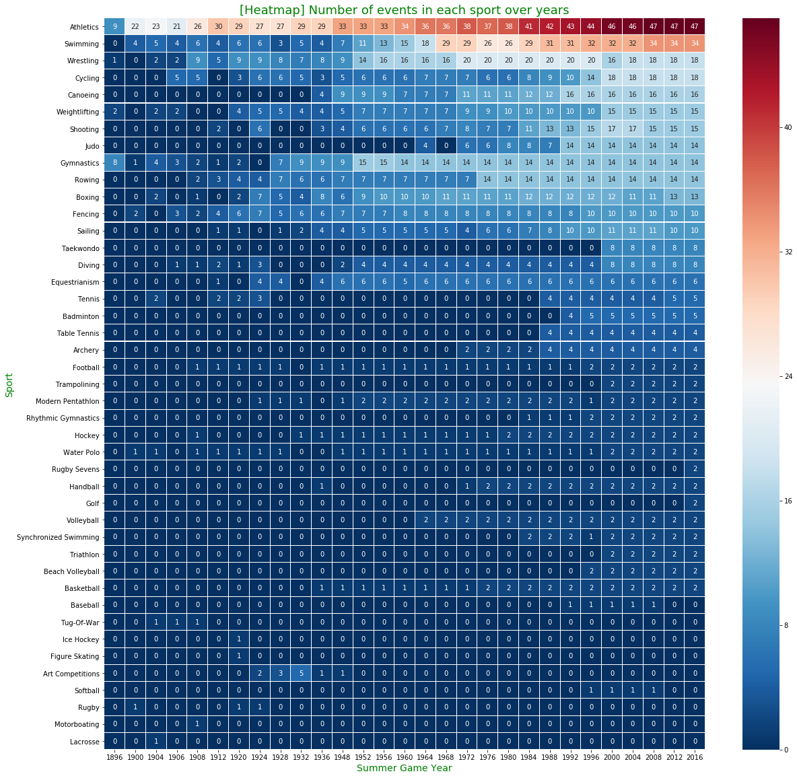
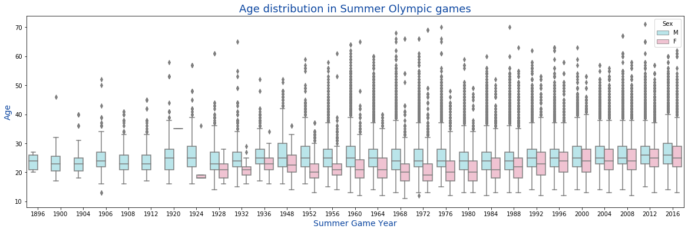
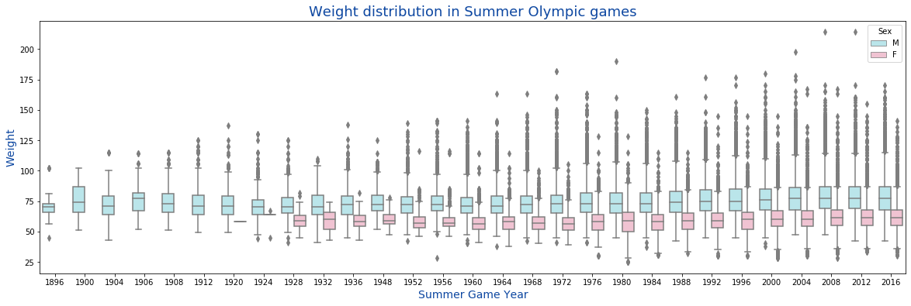
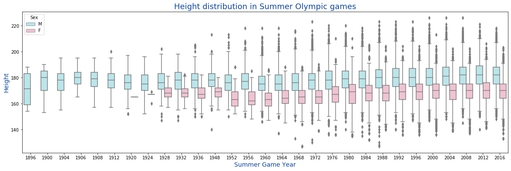
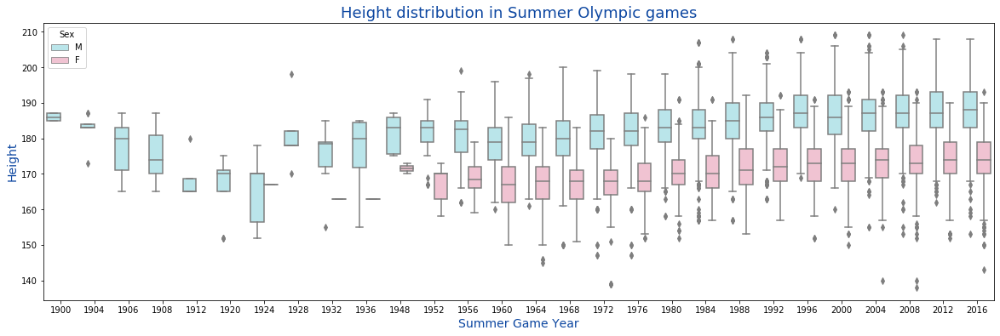
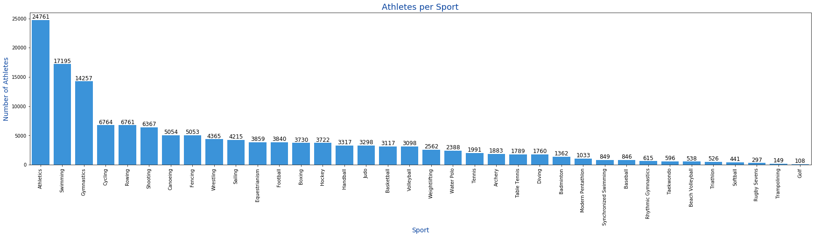
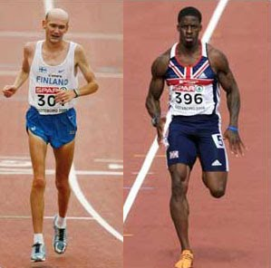
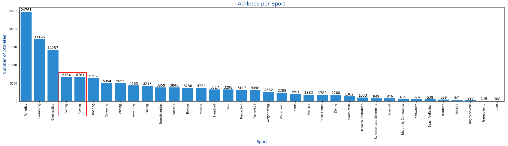

# Initial Analysis of Olympic Data

## Exploratory Analyis

* how have the olympic games grown over the years? 
* how have athletes changed over the years


```python
import numpy as np # linear algebra
import pandas as pd # data processing, CSV file I/O (e.g. pd.read_csv)

import seaborn as sns
import matplotlib.pyplot as plt
%matplotlib inline

import os
```


```python
athlete = pd.read_csv('input/athlete_events.csv')
noc = pd.read_csv('input/noc_regions.csv')

print('Athlete data: \nRows: {}\nCols: {}'.format(athlete.shape[0],athlete.shape[1]))
print(athlete.columns)

print('\nNOC data: \nRows: {}\nCols: {}'.format(noc.shape[0],noc.shape[1]))
print(noc.columns)
```

    Athlete data: 
    Rows: 271116
    Cols: 15
    Index(['ID', 'Name', 'Sex', 'Age', 'Height', 'Weight', 'Team', 'NOC', 'Games',
           'Year', 'Season', 'City', 'Sport', 'Event', 'Medal'],
          dtype='object')
    
    NOC data: 
    Rows: 230
    Cols: 3
    Index(['NOC', 'region', 'notes'], dtype='object')


### Let's look at the first entries of the NOC data and Athlete Data


```python
athlete.head()
```


<div>
<style scoped>
    .dataframe tbody tr th:only-of-type {
        vertical-align: middle;
    }

    .dataframe tbody tr th {
        vertical-align: top;
    }

    .dataframe thead th {
        text-align: right;
    }
</style>
<table border="1" class="dataframe">
  <thead>
    <tr style="text-align: right;">
      <th></th>
      <th>ID</th>
      <th>Name</th>
      <th>Sex</th>
      <th>Age</th>
      <th>Height</th>
      <th>Weight</th>
      <th>Team</th>
      <th>NOC</th>
      <th>Games</th>
      <th>Year</th>
      <th>Season</th>
      <th>City</th>
      <th>Sport</th>
      <th>Event</th>
      <th>Medal</th>
    </tr>
  </thead>
  <tbody>
    <tr>
      <th>0</th>
      <td>1</td>
      <td>A Dijiang</td>
      <td>M</td>
      <td>24.0</td>
      <td>180.0</td>
      <td>80.0</td>
      <td>China</td>
      <td>CHN</td>
      <td>1992 Summer</td>
      <td>1992</td>
      <td>Summer</td>
      <td>Barcelona</td>
      <td>Basketball</td>
      <td>Basketball Men's Basketball</td>
      <td>NaN</td>
    </tr>
    <tr>
      <th>1</th>
      <td>2</td>
      <td>A Lamusi</td>
      <td>M</td>
      <td>23.0</td>
      <td>170.0</td>
      <td>60.0</td>
      <td>China</td>
      <td>CHN</td>
      <td>2012 Summer</td>
      <td>2012</td>
      <td>Summer</td>
      <td>London</td>
      <td>Judo</td>
      <td>Judo Men's Extra-Lightweight</td>
      <td>NaN</td>
    </tr>
    <tr>
      <th>2</th>
      <td>3</td>
      <td>Gunnar Nielsen Aaby</td>
      <td>M</td>
      <td>24.0</td>
      <td>NaN</td>
      <td>NaN</td>
      <td>Denmark</td>
      <td>DEN</td>
      <td>1920 Summer</td>
      <td>1920</td>
      <td>Summer</td>
      <td>Antwerpen</td>
      <td>Football</td>
      <td>Football Men's Football</td>
      <td>NaN</td>
    </tr>
    <tr>
      <th>3</th>
      <td>4</td>
      <td>Edgar Lindenau Aabye</td>
      <td>M</td>
      <td>34.0</td>
      <td>NaN</td>
      <td>NaN</td>
      <td>Denmark/Sweden</td>
      <td>DEN</td>
      <td>1900 Summer</td>
      <td>1900</td>
      <td>Summer</td>
      <td>Paris</td>
      <td>Tug-Of-War</td>
      <td>Tug-Of-War Men's Tug-Of-War</td>
      <td>Gold</td>
    </tr>
    <tr>
      <th>4</th>
      <td>5</td>
      <td>Christine Jacoba Aaftink</td>
      <td>F</td>
      <td>21.0</td>
      <td>185.0</td>
      <td>82.0</td>
      <td>Netherlands</td>
      <td>NED</td>
      <td>1988 Winter</td>
      <td>1988</td>
      <td>Winter</td>
      <td>Calgary</td>
      <td>Speed Skating</td>
      <td>Speed Skating Women's 500 metres</td>
      <td>NaN</td>
    </tr>
  </tbody>
</table>
</div>


```python
noc.head()
```


<div>
<style scoped>
    .dataframe tbody tr th:only-of-type {
        vertical-align: middle;
    }

    .dataframe tbody tr th {
        vertical-align: top;
    }

    .dataframe thead th {
        text-align: right;
    }
</style>
<table border="1" class="dataframe">
  <thead>
    <tr style="text-align: right;">
      <th></th>
      <th>NOC</th>
      <th>region</th>
      <th>notes</th>
    </tr>
  </thead>
  <tbody>
    <tr>
      <th>0</th>
      <td>AFG</td>
      <td>Afghanistan</td>
      <td>NaN</td>
    </tr>
    <tr>
      <th>1</th>
      <td>AHO</td>
      <td>Curacao</td>
      <td>Netherlands Antilles</td>
    </tr>
    <tr>
      <th>2</th>
      <td>ALB</td>
      <td>Albania</td>
      <td>NaN</td>
    </tr>
    <tr>
      <th>3</th>
      <td>ALG</td>
      <td>Algeria</td>
      <td>NaN</td>
    </tr>
    <tr>
      <th>4</th>
      <td>AND</td>
      <td>Andorra</td>
      <td>NaN</td>
    </tr>
  </tbody>
</table>
</div>


## Filter on athletes with incomplete data

Since we are trying eventually use the data from each individual athlete to predict the sport they are participating in, we are going to filter on incomplete data. 


```python
athlete_filt = athlete[(athlete['Sex'].notnull()) & (athlete['Age'].notnull()) & (athlete['Height'].notnull())  & (athlete['Weight'].notnull()) & (athlete['NOC'].notnull()) & (athlete['Year'].notnull()) & (athlete['Season'].notnull()) & (athlete['Sport'].notnull())]

```


```python
#AthletesFiltered_Summer = athlete_filt.loc[(athlete_filt['Season'].isin(["Summer"])) & (athlete_filt['Year'] >= 1968)]
AthletesFiltered_Summer = athlete_filt.loc[(athlete_filt['Season'].isin(["Summer"]))]

print(AthletesFiltered_Summer.shape) 

athlete = AthletesFiltered_Summer
```

    (166706, 15)


## Initial Plotting (How have the games changed in the last 50 years?)


```python
games_athletes = athlete.pivot_table(athlete, index=['Games'], aggfunc=lambda x: len(x.unique())).reset_index()[['Games','ID']]
fig, ax = plt.subplots(figsize=(22,6))
a = sns.barplot(x='Games', y='ID', data=games_athletes, ax=ax, color="#2196F3")
a.set_xticklabels(labels=games_athletes['Games'],rotation=90)

for p in ax.patches:
    ax.text(p.get_x() + p.get_width()/2., p.get_height(), '%d' % int(p.get_height()), 
            fontsize=12, color='black', ha='center', va='bottom')

ax.set_xlabel('Olympic Game', size=14, color="#0D47A1")
ax.set_ylabel('Number of Athletes', size=14, color="#0D47A1")
ax.set_title('Athletes in each Olympic game', size=18, color="#0D47A1")

plt.show()
```





```python
sport_year = athlete[athlete['Season']=='Summer'].pivot_table(athlete, index=['Year','Sport'], aggfunc=lambda x: len(x.unique())).reset_index()[['Year','Sport','Event']]
sport_year = sport_year.pivot("Sport", "Year", "Event")
sport_year.fillna(0,inplace=True)
sport_year = sport_year.reindex(sport_year.sort_values(by=2016, ascending=False).index)
f, ax = plt.subplots(figsize=(20, 20))
sns.heatmap(sport_year, annot=True, linewidths=0.05, ax=ax, cmap="RdBu_r")
ax.set_xlabel('Summer Game Year', size=14, color="green")
ax.set_ylabel('Sport', size=14, color="green")
ax.set_title('[Heatmap] Number of events in each sport over years', size=18, color="green")
plt.show()
```





# How have the athletes changed?


* We are initially going to look at 3 simple metrics, Age, Weight and Height


```python
fig, ax = plt.subplots(figsize=(20,6))
a = sns.boxplot(x="Year", y="Age", hue="Sex", palette={"M": "#B2EBF2", "F":"#F8BBD0"}, data=athlete[athlete['Season']=='Summer'], ax=ax)
        
ax.set_xlabel('Summer Game Year', size=14, color="#0D47A1")
ax.set_ylabel('Age', size=14, color="#0D47A1")
ax.set_title('Age distribution in Summer Olympic games', size=18, color="#0D47A1")
plt.show()
```





```python
fig, ax = plt.subplots(figsize=(20,6))
a = sns.boxplot(x="Year", y="Weight", hue="Sex", palette={"M": "#B2EBF2", "F":"#F8BBD0"}, data=athlete[athlete['Season']=='Summer'], ax=ax)
        
ax.set_xlabel('Summer Game Year', size=14, color="#0D47A1")
ax.set_ylabel('Weight', size=14, color="#0D47A1")
ax.set_title('Weight distribution in Summer Olympic games', size=18, color="#0D47A1")
plt.show()
```





```python
fig, ax = plt.subplots(figsize=(20,6))
a = sns.boxplot(x="Year", y="Height", hue="Sex", palette={"M": "#B2EBF2", "F":"#F8BBD0"}, data=athlete[athlete['Season']=='Summer'], ax=ax)
        
ax.set_xlabel('Summer Game Year', size=14, color="#0D47A1")
ax.set_ylabel('Height', size=14, color="#0D47A1")
ax.set_title('Height distribution in Summer Olympic games', size=18, color="#0D47A1")
plt.show()
```





```python
fig, ax = plt.subplots(figsize=(20,6))
a = sns.boxplot(x="Year", y="Height", hue="Sex", palette={"M": "#B2EBF2", "F":"#F8BBD0"}, data=athlete[(athlete['Season']=='Summer') & (athlete['Sport']=="Swimming")], ax=ax)
        
ax.set_xlabel('Summer Game Year', size=14, color="#0D47A1")
ax.set_ylabel('Height', size=14, color="#0D47A1")
ax.set_title('Height distribution in Summer Olympic games', size=18, color="#0D47A1")
plt.show()
```





# Now for a predictive model


```python
# Let's if we can predict the sport of an athlete based on their body measurements

AthletesFiltered_Summer = athlete_filt.loc[(athlete_filt['Season'].isin(["Summer"])) & (athlete_filt['Year'] >= 1968)]
print(AthletesFiltered_Summer.shape) 


```

    (142506, 15)


```python
# number of athletes per sport

athletes_ps = AthletesFiltered_Summer[["Sport"]]
athletes_ps = athletes_ps["Sport"].value_counts()


#https://pandas.pydata.org/pandas-docs/stable/reference/api/pandas.Series.to_frame.html
athletes_per_sport = pd.DataFrame({"Sport":athletes_ps.index, "Athletes":athletes_ps.values})

fig, ax = plt.subplots(figsize=(30,6))
a = sns.barplot(x='Sport', y='Athletes', data=athletes_per_sport, ax=ax, color="#2196F3")
a.set_xticklabels(labels=athletes_per_sport['Sport'],rotation=90)

for p in ax.patches:
    ax.text(p.get_x() + p.get_width()/2., p.get_height(), '%d' % int(p.get_height()), 
            fontsize=12, color='black', ha='center', va='bottom')

ax.set_xlabel('Sport', size=14, color="#0D47A1")
ax.set_ylabel('Number of Athletes', size=14, color="#0D47A1")
ax.set_title('Athletes per Sport', size=18, color="#0D47A1")
plt.show()

```





# Look a little more into the Athletics sport

As we see in the graph that the sport is athletics, which is a combination of many sports that are part of the track and field. 

https://tokyo2020.org/en/games/sport/olympic/athletics/
### Event Programme
* 100m (Men/Women)
* 200m (Men/Women)
* 400m (Men/Women)
* 800m (Men/Women)
* 1,500m (Men/Women)
* 5,000m (Men/Women)
* 10,000m (Men/Women)
* 110m Hurdles (Men)
* 100m Hurdles (Women)
* 400m Hurdles (Men/Women)
* 3,000m Steeplechase (Men/Women)
* 4 x 100m Relay (Men/Women)
* 4 x 400m Relay (Men/Women)
* 4 x 400m Mixed Relay

One concern that I have is that sprinters (100m and 200m) have very different body-types than mid and long-distance runners (10,000m) and this might make the categorization difficult. 




```python
# now let's do the actual filtering. 
ToFilter = ['Swimming', 'Gynmastics']

AthletesFiltered_Summer_Sports = AthletesFiltered_Summer.loc[AthletesFiltered_Summer['Sport'].isin(ToFilter)]


```


```python
AthletesFiltered_Summer_Sports.head()
```


<div>
<style scoped>
    .dataframe tbody tr th:only-of-type {
        vertical-align: middle;
    }

    .dataframe tbody tr th {
        vertical-align: top;
    }

    .dataframe thead th {
        text-align: right;
    }
</style>
<table border="1" class="dataframe">
  <thead>
    <tr style="text-align: right;">
      <th></th>
      <th>ID</th>
      <th>Name</th>
      <th>Sex</th>
      <th>Age</th>
      <th>Height</th>
      <th>Weight</th>
      <th>Team</th>
      <th>NOC</th>
      <th>Games</th>
      <th>Year</th>
      <th>Season</th>
      <th>City</th>
      <th>Sport</th>
      <th>Event</th>
      <th>Medal</th>
    </tr>
  </thead>
  <tbody>
    <tr>
      <th>100</th>
      <td>36</td>
      <td>Stefan Remco Aartsen</td>
      <td>M</td>
      <td>21.0</td>
      <td>194.0</td>
      <td>78.0</td>
      <td>Netherlands</td>
      <td>NED</td>
      <td>1996 Summer</td>
      <td>1996</td>
      <td>Summer</td>
      <td>Atlanta</td>
      <td>Swimming</td>
      <td>Swimming Men's 100 metres Butterfly</td>
      <td>NaN</td>
    </tr>
    <tr>
      <th>101</th>
      <td>36</td>
      <td>Stefan Remco Aartsen</td>
      <td>M</td>
      <td>21.0</td>
      <td>194.0</td>
      <td>78.0</td>
      <td>Netherlands</td>
      <td>NED</td>
      <td>1996 Summer</td>
      <td>1996</td>
      <td>Summer</td>
      <td>Atlanta</td>
      <td>Swimming</td>
      <td>Swimming Men's 200 metres Butterfly</td>
      <td>NaN</td>
    </tr>
    <tr>
      <th>102</th>
      <td>36</td>
      <td>Stefan Remco Aartsen</td>
      <td>M</td>
      <td>21.0</td>
      <td>194.0</td>
      <td>78.0</td>
      <td>Netherlands</td>
      <td>NED</td>
      <td>1996 Summer</td>
      <td>1996</td>
      <td>Summer</td>
      <td>Atlanta</td>
      <td>Swimming</td>
      <td>Swimming Men's 4 x 100 metres Medley Relay</td>
      <td>NaN</td>
    </tr>
    <tr>
      <th>103</th>
      <td>36</td>
      <td>Stefan Remco Aartsen</td>
      <td>M</td>
      <td>25.0</td>
      <td>194.0</td>
      <td>78.0</td>
      <td>Netherlands</td>
      <td>NED</td>
      <td>2000 Summer</td>
      <td>2000</td>
      <td>Summer</td>
      <td>Sydney</td>
      <td>Swimming</td>
      <td>Swimming Men's 100 metres Butterfly</td>
      <td>NaN</td>
    </tr>
    <tr>
      <th>104</th>
      <td>36</td>
      <td>Stefan Remco Aartsen</td>
      <td>M</td>
      <td>25.0</td>
      <td>194.0</td>
      <td>78.0</td>
      <td>Netherlands</td>
      <td>NED</td>
      <td>2000 Summer</td>
      <td>2000</td>
      <td>Summer</td>
      <td>Sydney</td>
      <td>Swimming</td>
      <td>Swimming Men's 200 metres Butterfly</td>
      <td>NaN</td>
    </tr>
  </tbody>
</table>
</div>


## So here is what we did instead




```python
# now let's do the actual filtering. 
ToFilter = ['Cycling', 'Rowing']

AthletesFiltered_Summer_Sports = AthletesFiltered_Summer.loc[AthletesFiltered_Summer['Sport'].isin(ToFilter)]

```


```python
AthletesFiltered_Summer_Sports.head()
```


<div>
<style scoped>
    .dataframe tbody tr th:only-of-type {
        vertical-align: middle;
    }

    .dataframe tbody tr th {
        vertical-align: top;
    }

    .dataframe thead th {
        text-align: right;
    }
</style>
<table border="1" class="dataframe">
  <thead>
    <tr style="text-align: right;">
      <th></th>
      <th>ID</th>
      <th>Name</th>
      <th>Sex</th>
      <th>Age</th>
      <th>Height</th>
      <th>Weight</th>
      <th>Team</th>
      <th>NOC</th>
      <th>Games</th>
      <th>Year</th>
      <th>Season</th>
      <th>City</th>
      <th>Sport</th>
      <th>Event</th>
      <th>Medal</th>
    </tr>
  </thead>
  <tbody>
    <tr>
      <th>92</th>
      <td>30</td>
      <td>Pepijn Aardewijn</td>
      <td>M</td>
      <td>26.0</td>
      <td>189.0</td>
      <td>72.0</td>
      <td>Netherlands</td>
      <td>NED</td>
      <td>1996 Summer</td>
      <td>1996</td>
      <td>Summer</td>
      <td>Atlanta</td>
      <td>Rowing</td>
      <td>Rowing Men's Lightweight Double Sculls</td>
      <td>Silver</td>
    </tr>
    <tr>
      <th>93</th>
      <td>30</td>
      <td>Pepijn Aardewijn</td>
      <td>M</td>
      <td>30.0</td>
      <td>189.0</td>
      <td>72.0</td>
      <td>Netherlands</td>
      <td>NED</td>
      <td>2000 Summer</td>
      <td>2000</td>
      <td>Summer</td>
      <td>Sydney</td>
      <td>Rowing</td>
      <td>Rowing Men's Lightweight Double Sculls</td>
      <td>NaN</td>
    </tr>
    <tr>
      <th>158</th>
      <td>62</td>
      <td>Giovanni Abagnale</td>
      <td>M</td>
      <td>21.0</td>
      <td>198.0</td>
      <td>90.0</td>
      <td>Italy</td>
      <td>ITA</td>
      <td>2016 Summer</td>
      <td>2016</td>
      <td>Summer</td>
      <td>Rio de Janeiro</td>
      <td>Rowing</td>
      <td>Rowing Men's Coxless Pairs</td>
      <td>Bronze</td>
    </tr>
    <tr>
      <th>176</th>
      <td>74</td>
      <td>Mara Laura Abalo</td>
      <td>F</td>
      <td>30.0</td>
      <td>182.0</td>
      <td>73.0</td>
      <td>Argentina</td>
      <td>ARG</td>
      <td>2012 Summer</td>
      <td>2012</td>
      <td>Summer</td>
      <td>London</td>
      <td>Rowing</td>
      <td>Rowing Women's Coxless Pairs</td>
      <td>NaN</td>
    </tr>
    <tr>
      <th>195</th>
      <td>90</td>
      <td>Tamila Rashidovna Abasova</td>
      <td>F</td>
      <td>21.0</td>
      <td>163.0</td>
      <td>60.0</td>
      <td>Russia</td>
      <td>RUS</td>
      <td>2004 Summer</td>
      <td>2004</td>
      <td>Summer</td>
      <td>Athina</td>
      <td>Cycling</td>
      <td>Cycling Women's Sprint</td>
      <td>Silver</td>
    </tr>
  </tbody>
</table>
</div>


# Building TF Model

In order to build a tensorflow model. We are going to numerically encode our variables (more on that later), and build our training and test data


```python
from keras.models import Sequential
from keras.layers import Dense
from keras.wrappers.scikit_learn import KerasClassifier
from keras.utils import np_utils
from sklearn.model_selection import cross_val_score
from sklearn.model_selection import KFold
from sklearn.preprocessing import LabelEncoder
from sklearn.pipeline import Pipeline
# Importing the Keras libraries and packages
import keras
from keras.models import Sequential
from keras.layers import Dense
```


```python
#DataToEncode = pd.DataFrame({"Sex": AthletesFiltered_Summer_Sports['Sex'], "Age": AthletesFiltered_Summer_Sports['Age'], "Height": AthletesFiltered_Summer_Sports['Height'],  "Weight": AthletesFiltered_Summer_Sports['Weight'],  "NOC": AthletesFiltered_Summer_Sports['NOC']})
DataToEncode = pd.DataFrame({"Sex": AthletesFiltered_Summer_Sports['Sex'], "Age": AthletesFiltered_Summer_Sports['Age'], "Height": AthletesFiltered_Summer_Sports['Height'],  "Weight": AthletesFiltered_Summer_Sports['Weight']})

DataToEncode.head()
```


<div>
<style scoped>
    .dataframe tbody tr th:only-of-type {
        vertical-align: middle;
    }

    .dataframe tbody tr th {
        vertical-align: top;
    }

    .dataframe thead th {
        text-align: right;
    }
</style>
<table border="1" class="dataframe">
  <thead>
    <tr style="text-align: right;">
      <th></th>
      <th>Sex</th>
      <th>Age</th>
      <th>Height</th>
      <th>Weight</th>
    </tr>
  </thead>
  <tbody>
    <tr>
      <th>92</th>
      <td>M</td>
      <td>26.0</td>
      <td>189.0</td>
      <td>72.0</td>
    </tr>
    <tr>
      <th>93</th>
      <td>M</td>
      <td>30.0</td>
      <td>189.0</td>
      <td>72.0</td>
    </tr>
    <tr>
      <th>158</th>
      <td>M</td>
      <td>21.0</td>
      <td>198.0</td>
      <td>90.0</td>
    </tr>
    <tr>
      <th>176</th>
      <td>F</td>
      <td>30.0</td>
      <td>182.0</td>
      <td>73.0</td>
    </tr>
    <tr>
      <th>195</th>
      <td>F</td>
      <td>21.0</td>
      <td>163.0</td>
      <td>60.0</td>
    </tr>
  </tbody>
</table>
</div>


```python
# making the training data into a numeric array
from sklearn.preprocessing import LabelEncoder, OneHotEncoder
my_labelencoder = LabelEncoder()
DataToEncode['Sex'] = my_labelencoder.fit_transform(DataToEncode["Sex"])
#my_labelencoder2 = LabelEncoder()
#DataToEncode['NOC'] = my_labelencoder2.fit_transform(DataToEncode["NOC"])
InputAthleteData = DataToEncode.to_numpy()
```


```python
# encoding the output variable

# why is this needed?
# Label encoding has introduced new problem in our data... Sports like Sailing and Wrestling have been given numbers, but one is not "higher" than another. These are now converted into dummy varaible
# resource : https://medium.com/@pushkarmandot/build-your-first-deep-learning-neural-network-model-using-keras-in-python-a90b5864116d

Y = AthletesFiltered_Summer_Sports["Sport"].values.tolist()
# lab
encoder = LabelEncoder()
dummy_y = encoder.fit_transform(Y)

```

## Splitting Training and Testing Data

We will make use of ScikitLearn’s ‘train_test_split’ function to divide our data (80:20)


```python
from sklearn.model_selection import train_test_split
X_train, X_test, y_train, y_test = train_test_split(InputAthleteData, dummy_y, test_size = 0.2)
```

## Scaling Input Data

https://scikit-learn.org/stable/modules/generated/sklearn.preprocessing.StandardScaler.html

Standardize features by removing the mean and scaling to unit variance


```python
# Feature Scaling
from sklearn.preprocessing import StandardScaler
sc = StandardScaler()
X_train = sc.fit_transform(X_train)
X_test = sc.transform(X_test)
```


```python
# model itself
# simplest we cand o : uniform distribution for the kernel initialization
# activation is : Rectified Linear Unit (ReLU).
classifier = Sequential()
# Adding the input layer and the first hidden layer
classifier.add(Dense(units = 6, kernel_initializer = 'uniform', activation = 'relu', input_dim = 4))
# Adding the second hidden layer
classifier.add(Dense(units = 6, kernel_initializer = 'uniform', activation = 'relu'))
# Adding the output layer
classifier.add(Dense(units = 1, kernel_initializer = 'uniform', activation = 'sigmoid'))
```


```python
# Compiling Neural Network
classifier.compile(optimizer = 'adam', loss = 'binary_crossentropy', metrics = ['accuracy'])
```


```python
classifier.fit(X_train, y_train, batch_size = 10, nb_epoch = 100)
```

    Epoch 1/100
     2390/10820 [=====>........................] - ETA: 0s - loss: 0.4222 - accuracy: 0.8167

    /Users/willshin/anaconda3/anaconda3/lib/python3.7/site-packages/ipykernel_launcher.py:1: UserWarning: The `nb_epoch` argument in `fit` has been renamed `epochs`.
      """Entry point for launching an IPython kernel.


    10820/10820 [==============================] - 1s 82us/step - loss: 0.4163 - accuracy: 0.8178
    Epoch 2/100
    10820/10820 [==============================] - 1s 69us/step - loss: 0.4168 - accuracy: 0.8177
    Epoch 3/100
    10820/10820 [==============================] - 1s 69us/step - loss: 0.4162 - accuracy: 0.8188
    Epoch 4/100
    10820/10820 [==============================] - 1s 76us/step - loss: 0.4156 - accuracy: 0.8195
    Epoch 5/100
    10820/10820 [==============================] - 1s 99us/step - loss: 0.4164 - accuracy: 0.8173
    Epoch 6/100
    10820/10820 [==============================] - 1s 79us/step - loss: 0.4165 - accuracy: 0.8174
    Epoch 7/100
    10820/10820 [==============================] - 1s 71us/step - loss: 0.4166 - accuracy: 0.8206
    Epoch 8/100
    10820/10820 [==============================] - 1s 75us/step - loss: 0.4164 - accuracy: 0.8177
    Epoch 9/100
    10820/10820 [==============================] - 1s 71us/step - loss: 0.4162 - accuracy: 0.8201
    Epoch 10/100
    10820/10820 [==============================] - 1s 74us/step - loss: 0.4161 - accuracy: 0.8183
    Epoch 11/100
    10820/10820 [==============================] - 1s 70us/step - loss: 0.4163 - accuracy: 0.8182
    Epoch 12/100
    10820/10820 [==============================] - 1s 72us/step - loss: 0.4163 - accuracy: 0.8172
    Epoch 13/100
    10820/10820 [==============================] - 1s 67us/step - loss: 0.4164 - accuracy: 0.8185
    Epoch 14/100
    10820/10820 [==============================] - 1s 69us/step - loss: 0.4163 - accuracy: 0.8174
    Epoch 15/100
    10820/10820 [==============================] - 1s 87us/step - loss: 0.4161 - accuracy: 0.8176
    Epoch 16/100
    10820/10820 [==============================] - 1s 75us/step - loss: 0.4162 - accuracy: 0.8188
    Epoch 17/100
    10820/10820 [==============================] - 1s 72us/step - loss: 0.4162 - accuracy: 0.8188
    Epoch 18/100
    10820/10820 [==============================] - 1s 74us/step - loss: 0.4160 - accuracy: 0.8177
    Epoch 19/100
    10820/10820 [==============================] - 1s 73us/step - loss: 0.4165 - accuracy: 0.8183
    Epoch 20/100
    10820/10820 [==============================] - 1s 71us/step - loss: 0.4161 - accuracy: 0.8190
    Epoch 21/100
    10820/10820 [==============================] - 1s 72us/step - loss: 0.4163 - accuracy: 0.8192
    Epoch 22/100
    10820/10820 [==============================] - 1s 98us/step - loss: 0.4160 - accuracy: 0.8191
    Epoch 23/100
    10820/10820 [==============================] - 1s 96us/step - loss: 0.4159 - accuracy: 0.8191
    Epoch 24/100
    10820/10820 [==============================] - 1s 101us/step - loss: 0.4161 - accuracy: 0.8178
    Epoch 25/100
    10820/10820 [==============================] - 1s 123us/step - loss: 0.4160 - accuracy: 0.8188
    Epoch 26/100
    10820/10820 [==============================] - 1s 114us/step - loss: 0.4159 - accuracy: 0.8180
    Epoch 27/100
    10820/10820 [==============================] - 1s 92us/step - loss: 0.4159 - accuracy: 0.8187
    Epoch 28/100
    10820/10820 [==============================] - 1s 90us/step - loss: 0.4162 - accuracy: 0.8194
    Epoch 29/100
    10820/10820 [==============================] - 1s 82us/step - loss: 0.4160 - accuracy: 0.8172
    Epoch 30/100
    10820/10820 [==============================] - 1s 87us/step - loss: 0.4162 - accuracy: 0.8198
    Epoch 31/100
    10820/10820 [==============================] - 1s 103us/step - loss: 0.4163 - accuracy: 0.8182
    Epoch 32/100
    10820/10820 [==============================] - 1s 105us/step - loss: 0.4158 - accuracy: 0.8168
    Epoch 33/100
    10820/10820 [==============================] - 1s 135us/step - loss: 0.4161 - accuracy: 0.8191
    Epoch 34/100
    10820/10820 [==============================] - 1s 125us/step - loss: 0.4162 - accuracy: 0.8184
    Epoch 35/100
    10820/10820 [==============================] - 1s 128us/step - loss: 0.4160 - accuracy: 0.8191
    Epoch 36/100
    10820/10820 [==============================] - 1s 116us/step - loss: 0.4160 - accuracy: 0.8181
    Epoch 37/100
    10820/10820 [==============================] - 1s 121us/step - loss: 0.4161 - accuracy: 0.8186
    Epoch 38/100
    10820/10820 [==============================] - 1s 96us/step - loss: 0.4157 - accuracy: 0.8189
    Epoch 39/100
    10820/10820 [==============================] - 1s 77us/step - loss: 0.4163 - accuracy: 0.8169
    Epoch 40/100
    10820/10820 [==============================] - 1s 84us/step - loss: 0.4159 - accuracy: 0.8182
    Epoch 41/100
    10820/10820 [==============================] - 1s 80us/step - loss: 0.4159 - accuracy: 0.8196
    Epoch 42/100
    10820/10820 [==============================] - 1s 76us/step - loss: 0.4159 - accuracy: 0.8178
    Epoch 43/100
    10820/10820 [==============================] - 1s 77us/step - loss: 0.4161 - accuracy: 0.8180
    Epoch 44/100
    10820/10820 [==============================] - 1s 80us/step - loss: 0.4159 - accuracy: 0.8190
    Epoch 45/100
    10820/10820 [==============================] - 1s 81us/step - loss: 0.4155 - accuracy: 0.8183
    Epoch 46/100
    10820/10820 [==============================] - 1s 90us/step - loss: 0.4158 - accuracy: 0.8191
    Epoch 47/100
    10820/10820 [==============================] - 1s 101us/step - loss: 0.4160 - accuracy: 0.8189
    Epoch 48/100
    10820/10820 [==============================] - 1s 98us/step - loss: 0.4158 - accuracy: 0.8182
    Epoch 49/100
    10820/10820 [==============================] - 1s 105us/step - loss: 0.4156 - accuracy: 0.8197
    Epoch 50/100
    10820/10820 [==============================] - 1s 82us/step - loss: 0.4157 - accuracy: 0.8182
    Epoch 51/100
    10820/10820 [==============================] - 1s 89us/step - loss: 0.4159 - accuracy: 0.8189
    Epoch 52/100
    10820/10820 [==============================] - 1s 96us/step - loss: 0.4154 - accuracy: 0.8177
    Epoch 53/100
    10820/10820 [==============================] - 1s 105us/step - loss: 0.4156 - accuracy: 0.8195
    Epoch 54/100
    10820/10820 [==============================] - 1s 87us/step - loss: 0.4153 - accuracy: 0.8196
    Epoch 55/100
    10820/10820 [==============================] - 1s 86us/step - loss: 0.4156 - accuracy: 0.8186
    Epoch 56/100
    10820/10820 [==============================] - 1s 92us/step - loss: 0.4153 - accuracy: 0.8186
    Epoch 57/100
    10820/10820 [==============================] - 1s 95us/step - loss: 0.4151 - accuracy: 0.8184
    Epoch 58/100
    10820/10820 [==============================] - 1s 95us/step - loss: 0.4148 - accuracy: 0.8186
    Epoch 59/100
    10820/10820 [==============================] - 1s 95us/step - loss: 0.4150 - accuracy: 0.8191
    Epoch 60/100
    10820/10820 [==============================] - 1s 94us/step - loss: 0.4142 - accuracy: 0.8197
    Epoch 61/100
    10820/10820 [==============================] - 1s 98us/step - loss: 0.4136 - accuracy: 0.8189
    Epoch 62/100
    10820/10820 [==============================] - 1s 105us/step - loss: 0.4122 - accuracy: 0.8190
    Epoch 63/100
    10820/10820 [==============================] - 1s 92us/step - loss: 0.4105 - accuracy: 0.8193 0s - l
    Epoch 64/100
    10820/10820 [==============================] - 1s 100us/step - loss: 0.4080 - accuracy: 0.8197
    Epoch 65/100
    10820/10820 [==============================] - 1s 101us/step - loss: 0.4065 - accuracy: 0.8201
    Epoch 66/100
    10820/10820 [==============================] - 1s 96us/step - loss: 0.4049 - accuracy: 0.8193
    Epoch 67/100
    10820/10820 [==============================] - 1s 116us/step - loss: 0.4030 - accuracy: 0.8213
    Epoch 68/100
    10820/10820 [==============================] - 1s 88us/step - loss: 0.4023 - accuracy: 0.8196
    Epoch 69/100
    10820/10820 [==============================] - 1s 75us/step - loss: 0.4012 - accuracy: 0.8200
    Epoch 70/100
    10820/10820 [==============================] - 1s 94us/step - loss: 0.3999 - accuracy: 0.8210
    Epoch 71/100
    10820/10820 [==============================] - 1s 100us/step - loss: 0.3991 - accuracy: 0.8212
    Epoch 72/100
    10820/10820 [==============================] - 1s 109us/step - loss: 0.3979 - accuracy: 0.8237
    Epoch 73/100
    10820/10820 [==============================] - 1s 76us/step - loss: 0.3967 - accuracy: 0.8228
    Epoch 74/100
    10820/10820 [==============================] - 1s 82us/step - loss: 0.3956 - accuracy: 0.8253
    Epoch 75/100
    10820/10820 [==============================] - 1s 121us/step - loss: 0.3948 - accuracy: 0.8263
    Epoch 76/100
    10820/10820 [==============================] - 1s 82us/step - loss: 0.3939 - accuracy: 0.8262
    Epoch 77/100
    10820/10820 [==============================] - 1s 74us/step - loss: 0.3933 - accuracy: 0.8264
    Epoch 78/100
    10820/10820 [==============================] - 1s 78us/step - loss: 0.3922 - accuracy: 0.8287
    Epoch 79/100
    10820/10820 [==============================] - 1s 84us/step - loss: 0.3919 - accuracy: 0.8297
    Epoch 80/100
    10820/10820 [==============================] - 1s 107us/step - loss: 0.3910 - accuracy: 0.8299
    Epoch 81/100
    10820/10820 [==============================] - 1s 81us/step - loss: 0.3903 - accuracy: 0.8315
    Epoch 82/100
    10820/10820 [==============================] - 1s 95us/step - loss: 0.3904 - accuracy: 0.8305
    Epoch 83/100
    10820/10820 [==============================] - 1s 80us/step - loss: 0.3898 - accuracy: 0.8308
    Epoch 84/100
    10820/10820 [==============================] - 1s 70us/step - loss: 0.3887 - accuracy: 0.8321
    Epoch 85/100
    10820/10820 [==============================] - 1s 76us/step - loss: 0.3885 - accuracy: 0.8322
    Epoch 86/100
    10820/10820 [==============================] - 1s 74us/step - loss: 0.3878 - accuracy: 0.8323
    Epoch 87/100
    10820/10820 [==============================] - 1s 81us/step - loss: 0.3877 - accuracy: 0.8311
    Epoch 88/100
    10820/10820 [==============================] - 1s 78us/step - loss: 0.3874 - accuracy: 0.8322
    Epoch 89/100
    10820/10820 [==============================] - 1s 71us/step - loss: 0.3862 - accuracy: 0.8329
    Epoch 90/100
    10820/10820 [==============================] - 1s 80us/step - loss: 0.3860 - accuracy: 0.8342
    Epoch 91/100
    10820/10820 [==============================] - 1s 77us/step - loss: 0.3846 - accuracy: 0.8352
    Epoch 92/100
    10820/10820 [==============================] - 1s 74us/step - loss: 0.3832 - accuracy: 0.8367
    Epoch 93/100
    10820/10820 [==============================] - 1s 74us/step - loss: 0.3821 - accuracy: 0.8357
    Epoch 94/100
    10820/10820 [==============================] - 1s 72us/step - loss: 0.3806 - accuracy: 0.8364
    Epoch 95/100
    10820/10820 [==============================] - 1s 72us/step - loss: 0.3793 - accuracy: 0.8358
    Epoch 96/100
    10820/10820 [==============================] - 1s 92us/step - loss: 0.3775 - accuracy: 0.8381
    Epoch 97/100
    10820/10820 [==============================] - 1s 74us/step - loss: 0.3761 - accuracy: 0.8355
    Epoch 98/100
    10820/10820 [==============================] - 1s 70us/step - loss: 0.3747 - accuracy: 0.8366
    Epoch 99/100
    10820/10820 [==============================] - 1s 72us/step - loss: 0.3732 - accuracy: 0.8359
    Epoch 100/100
    10820/10820 [==============================] - 1s 70us/step - loss: 0.3718 - accuracy: 0.8341


    <keras.callbacks.callbacks.History at 0x1a2166db70>


```python
# Predicting the Test set results
y_pred = classifier.predict(X_test)
y_pred = (y_pred > 0.5)
```

# Confusion Matrix


```python
import tensorflow as tf     

con = tf.math.confusion_matrix(labels=y_test, predictions=y_pred )
con
```


    <tf.Tensor: id=1625998, shape=(2, 2), dtype=int32, numpy=
    array([[1116,  221],
           [ 274, 1094]], dtype=int32)>


```python
# Accuracy: Overall, how often is the classifier correct?
# (TP+TN)/total = (1136+1061)/(1136 + 229 + 279 + 1061)
(1136+1061)/(1136 + 229 + 279 + 1061)
```


    0.8121996303142329


```python
# Accuracy: Overall, how often is the classifier correct?
# (TP+TN)/total = (1116+1094)/(1136 + 229 + 279 + 1061)
(1116+1094)/(1136 + 229 + 279 + 1061)
```


    0.8170055452865065


